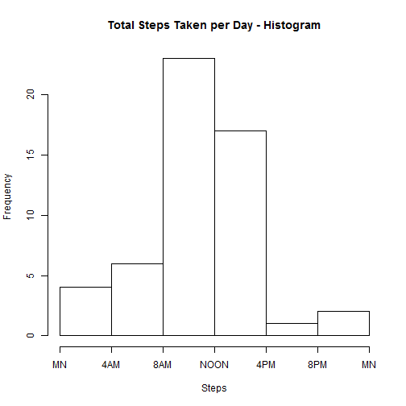
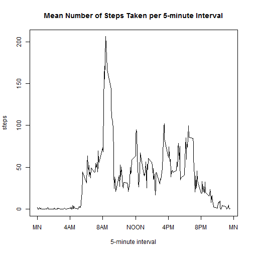
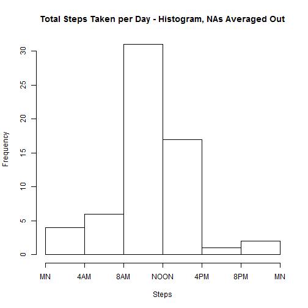
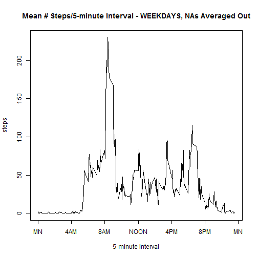
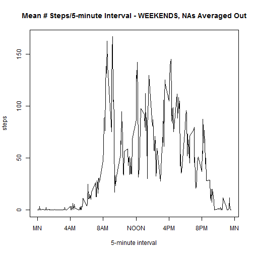

Title: "Number of steps taken in 5 minute intervals"  
Author: "John J. Como, MD, MPH"  
Date: "Sunday, May 17, 2015"  
Output: html_document  
self.contained: FALSE  
_______________________________________________________________________________________________________________________

LOADING AND PREPROCESSING THE DATA  
I will now read in the "activity.csv" file.


```r
dataset<-read.csv("activity.csv")
```

WHAT IS THE MEAN TOTAL NUMBER OF STEPS TAKEN PER DAY?  
The total number of steps taken per day is:


```r
total_steps_per_day<-aggregate(dataset[1], by=dataset[2], sum)
total_steps_per_day
```

```
##          date steps
## 1  2012-10-01    NA
## 2  2012-10-02   126
## 3  2012-10-03 11352
## 4  2012-10-04 12116
## 5  2012-10-05 13294
## 6  2012-10-06 15420
## 7  2012-10-07 11015
## 8  2012-10-08    NA
## 9  2012-10-09 12811
## 10 2012-10-10  9900
## 11 2012-10-11 10304
## 12 2012-10-12 17382
## 13 2012-10-13 12426
## 14 2012-10-14 15098
## 15 2012-10-15 10139
## 16 2012-10-16 15084
## 17 2012-10-17 13452
## 18 2012-10-18 10056
## 19 2012-10-19 11829
## 20 2012-10-20 10395
## 21 2012-10-21  8821
## 22 2012-10-22 13460
## 23 2012-10-23  8918
## 24 2012-10-24  8355
## 25 2012-10-25  2492
## 26 2012-10-26  6778
## 27 2012-10-27 10119
## 28 2012-10-28 11458
## 29 2012-10-29  5018
## 30 2012-10-30  9819
## 31 2012-10-31 15414
## 32 2012-11-01    NA
## 33 2012-11-02 10600
## 34 2012-11-03 10571
## 35 2012-11-04    NA
## 36 2012-11-05 10439
## 37 2012-11-06  8334
## 38 2012-11-07 12883
## 39 2012-11-08  3219
## 40 2012-11-09    NA
## 41 2012-11-10    NA
## 42 2012-11-11 12608
## 43 2012-11-12 10765
## 44 2012-11-13  7336
## 45 2012-11-14    NA
## 46 2012-11-15    41
## 47 2012-11-16  5441
## 48 2012-11-17 14339
## 49 2012-11-18 15110
## 50 2012-11-19  8841
## 51 2012-11-20  4472
## 52 2012-11-21 12787
## 53 2012-11-22 20427
## 54 2012-11-23 21194
## 55 2012-11-24 14478
## 56 2012-11-25 11834
## 57 2012-11-26 11162
## 58 2012-11-27 13646
## 59 2012-11-28 10183
## 60 2012-11-29  7047
## 61 2012-11-30    NA
```

A histogram of the number of steps taken per days is:


```r
hist(total_steps_per_day[,2], main="Total Steps Taken per Day - Histogram", xlab="Steps", breaks=c(0,4000,8000,12000,16000,20000,24000), xaxt='n')
axis(side=1, at=c(0,4000,8000,12000,16000,20000,24000), labels=c("MN","4AM","8AM","NOON","4PM","8PM","MN"))
```

 

The mean number of steps taken per day is:


```r
mean_steps_per_day<-mean(total_steps_per_day[,2], na.rm=TRUE)
mean_steps_per_day
```

```
## [1] 10766.19
```

The median number of steps taken per day is:


```r
median_steps_per_day<-median(total_steps_per_day[,2], na.rm=TRUE)
median_steps_per_day
```

```
## [1] 10765
```

WHAT IS THE AVERAGE DAILY ACTIVITY PATTERN?  
Time series plot of the 5-minute interval (x-axis) and the average number of steps taken, averaged across all days (y-axis):


```r
mean_steps_per_interval<-aggregate(dataset[1], by=dataset[3], mean, na.rm=TRUE)
plot(mean_steps_per_interval, type="l", xaxt='n', main="Mean Number of Steps Taken per 5-minute Interval", xlab="5-minute interval")
axis(side=1, at=c(0,400,800,1200,1600,2000,2400), labels=c("MN","4AM","8AM","NOON","4PM","8PM","MN"))
```

 

Which 5-minute interval, on average across all days in the dataset, contains the maximum number of steps?


```r
period_with_most_steps<-order(mean_steps_per_interval[,2], decreasing=TRUE)[1]
interval_with_most_steps<-mean_steps_per_interval[period_with_most_steps, 1]
interval_with_most_steps
```

```
## [1] 835
```

IMPUTING MISSING VALUES  
Number of missing values in the dataset:


```r
steps_na<-sum(is.na(dataset[, 1]))
steps_na
```

```
## [1] 2304
```

Strategy for filling in all of the missing values in the dataset - will give these NA vales the average number of steps in that interval

Create a new dataset that has all the missing data filled in


```r
datasetNoNA<-subset(dataset, steps!="NA")
rowsNA<-which(is.na(dataset[,1]))
datasetIsNA<-dataset[rowsNA, ]

for (i in 1:dim(mean_steps_per_interval)[1]) {
rows2Fill<-which(datasetIsNA[,3]==mean_steps_per_interval[i,1])
datasetIsNA[rows2Fill, 1]<-mean_steps_per_interval[i,2]
}

datasetNAGone<-rbind(datasetNoNA, datasetIsNA)
```

Histogram of the total number of steps taken each day


```r
total_steps_per_day<-aggregate(datasetNAGone[1], by=datasetNAGone[2], sum)
hist(total_steps_per_day[,2], main="Total Steps Taken per Day - Histogram, NAs Averaged Out", xlab="Steps", breaks=c(0,4000,8000,12000,16000,20000,24000), xaxt='n')
axis(side=1, at=c(0,4000,8000,12000,16000,20000,24000), labels=c("MN","4AM","8AM","NOON","4PM","8PM","MN"))
```

 

Mean number of steps taken each day:


```r
mean_steps_per_day<-mean(total_steps_per_day[,2], na.rm=TRUE)
mean_steps_per_day
```

```
## [1] 10766.19
```

Median number of steps taken each day


```r
median_steps_per_day<-median(total_steps_per_day[,2], na.rm=TRUE)
median_steps_per_day
```

```
## [1] 10766.19
```

Do these values differ from the estimated from the first part of the assignment?  
NO
What is the impact of imputing missing data on the estimates of the total daily number of steps?  
NO CHANGE

ARE THERE ANY DIFFERENCES IN ACTIVITY PATTERNS BETWEEN WEEKDAYS AND WEEKENDS?  
Create a new factor variable in the dataset with two levels - "weekday" and "weekend"


```r
datasetNAGone[,4]<-(weekdays(as.POSIXct(datasetNAGone[,2])))
colnames(datasetNAGone)<-c(colnames(datasetNAGone)[1:3], "day")
datasetWD<-subset(datasetNAGone, (day!="Saturday")&(day!="Sunday"))
datasetWE<-subset(datasetNAGone, (day=="Saturday")|(day=="Sunday"))
```

Panel plot containing a time series plot of the 5-minute interval  (x-axis) and the average number of steps taken, averaged across all weekday days or weekend days (y-axis)


```r
mean_steps_per_interval_WD<-aggregate(datasetWD[1], by=datasetWD[3], mean, na.rm=TRUE)
plot(mean_steps_per_interval_WD, type="l", xaxt='n', main="Mean # Steps/5-minute Interval - WEEKDAYS, NAs Averaged Out", xlab="5-minute interval")
axis(side=1, at=c(0,400,800,1200,1600,2000,2400), labels=c("MN","4AM","8AM","NOON","4PM","8PM","MN"))
```

 

```r
mean_steps_per_interval_WE<-aggregate(datasetWE[1], by=datasetWE[3], mean, na.rm=TRUE)
plot(mean_steps_per_interval_WE, type="l", xaxt='n', main="Mean # Steps/5-minute Interval - WEEKENDS, NAs Averaged Out", xlab="5-minute interval")
axis(side=1, at=c(0,400,800,1200,1600,2000,2400), labels=c("MN","4AM","8AM","NOON","4PM","8PM","MN"))
```

 
